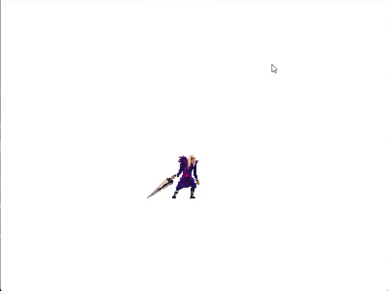
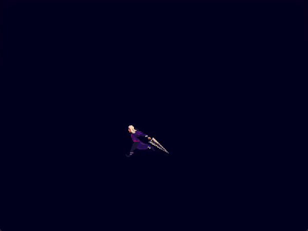
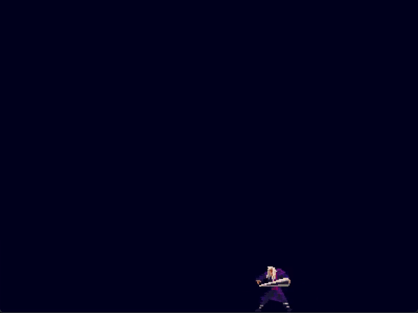
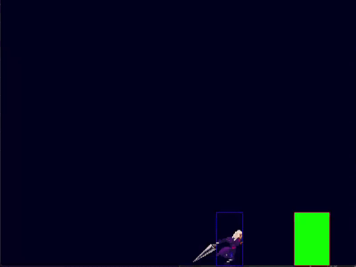
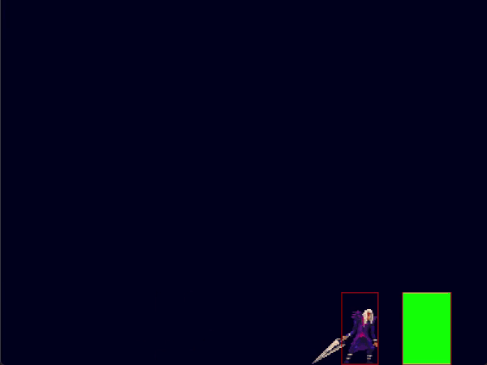
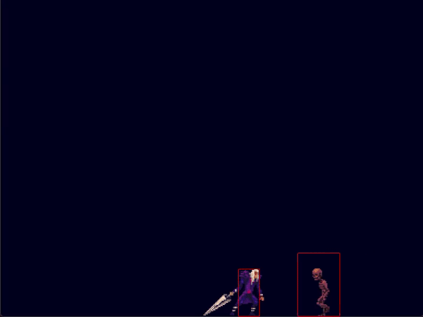
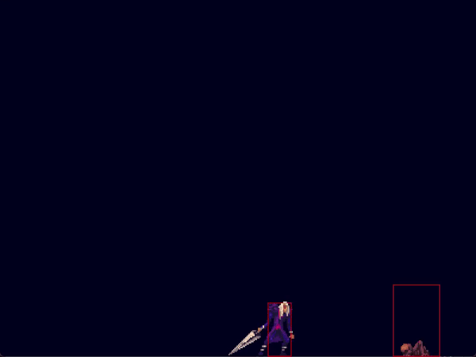
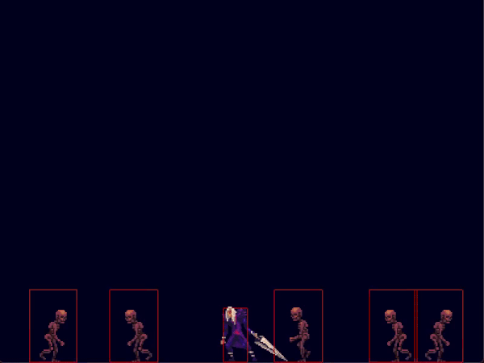

# UNLaM-Programacion-API-Pygame-Grupo-05 / TOWER OF DEATH
### Actividad Practica Integradora (API) de Programación
### Primer Cuatrimestre de la Tenicatura en Desarrollo de Videojuegos (UNLaM) (2025)

## ¿De qué se trata?
### Tower of Death es un **Survival Defender Arena** donde el objetivo es defender una estructura de oleadas de enemigos laterales.

## Assets que usé
### Música del Menú: Propia
### Música de Combate: [Purgatory Extreme Metal Music Pack](https://davidkbd.itch.io/purgatory-extreme-metal-music-pack) (gratis!)
### Sprites: [Gothicvania Cemetery Pack](https://opengameart.org/content/gothicvania-cemetery-pack) (gratis!)

# Progreso
### Pequeño lapso de tiempo los primeros días del proeycto donde documente en GIFs mis avances.
## Día 1
### Movimiento

### Animaciones de movimiento y ataque

### Un Outline (Para el feedback de daño)

## Día 2
### Hitboxes y Colisiones

## Día 3
### Hitbox del ataque

## Día 4
### Enemigo

### Animación de spawn

### Pool de enemigos

